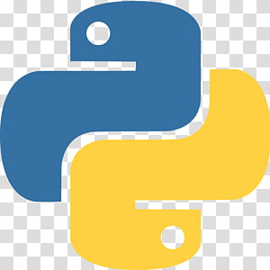
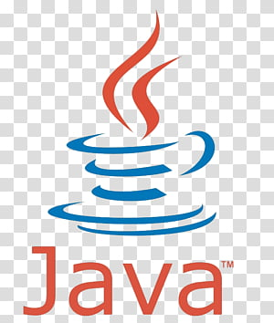
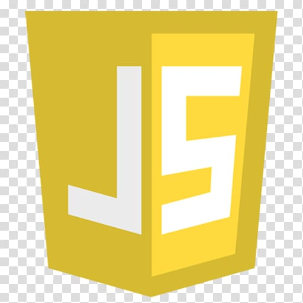
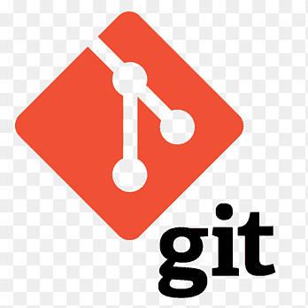

### Hi, I'm Javier! 👋

<!-- Badges -->

<!-- Contents -->
## 🚀 About Me
I'm a third-year student at [UAM](https://www.uam.es/uam/informatica-matematicas) (Madrid) pursuing a **Dual Degree in Mathematics and Computer Science** 💻📘

  

## ✨ Interests 
 * **Linux** and *operating systems* in general 🐧
 * **Software** development 👾
 * **AI/ML** ⚙️
 * **Probability** and **statistics** 🎲
 * **Mathematical analysis** 🔢
 * Advanced *mathematical* **problems** 🧠

## 🛠️ Tech Stack

**Languages**

**Tools**

## 💡 Projects
* **Arch Linux** [dotfiles]()
* **Gentoo Linux** reliable `make.conf` for *VMWare*
* Basic [**shell**]() written in C
* `cmatrix` [custom implementation]() in **C**

*More* in the future!

## 📈 Github Stats 

<!---->

<!-- Created with the help of readme.so -->
